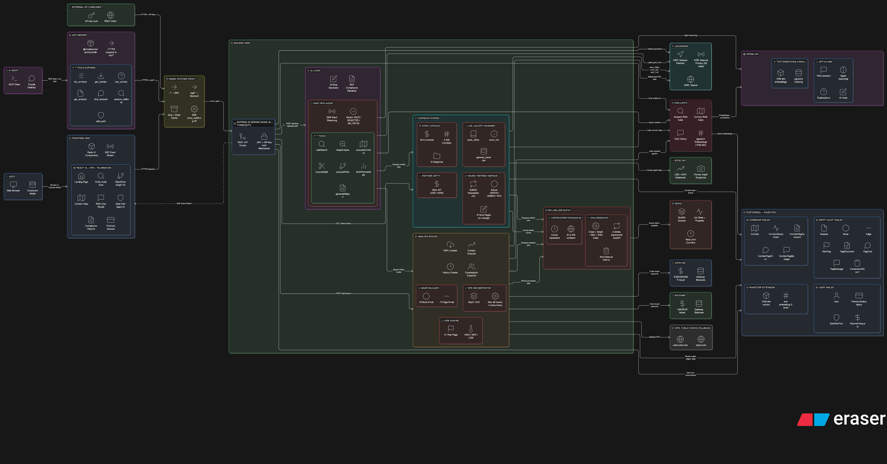

# CORLens ([cor-lens.xyz](https://cor-lens.xyz))

### AI-powered risk intelligence & autonomous compliance agent for XRPL DeFi

[](https://youtu.be/JYIxANpQtms)
[](./LICENSE)
[](#local-setup)
[](https://pnpm.io/)

CORLens is a full-stack platform for mapping, understanding, and auditing the infrastructure behind cross-border payments on the XRP Ledger.

The system automatically catalogues 2,436 live fiat corridors, classifies how each one settles on XRPL, and exposes an interactive knowledge graph of every entity touching a corridor -- issuers, AMM pools, liquidity providers, trust lines, escrows, and payment paths.

A built-in Safe Path AI Agent can receive natural-language instructions (for example: "route 1M from USD to MXN through the safest corridor") and analyze the route autonomously -- crawling live XRPL state, flagging risks, proposing split plans, and generating a downloadable compliance report.

---

## What the platform does

| Feature | Description |
| --- | --- |
| Corridor Atlas | Browse 2,436 live fiat payment corridors across 48 currencies with real-time health status (GREEN / AMBER / RED), actor breakdown, and partner orderbook depth |
| Safe Path AI Agent | Multi-step AI agent that analyzes cross-border payment compliance by calling 7 tools against live XRPL data, proposes split routing for large amounts, and generates downloadable compliance reports |
| Entity Audit Graph | Crawl any XRPL address and visualize the trust line network, AMM pools, risk flags, and dependencies as an interactive knowledge graph (18 node types, 19 edge types) |
| RAG Chat | Natural language queries over crawled XRPL data -- ask questions grounded in actual on-chain state, not hallucinated |
| MCP Server | Let Claude talk to CORLens directly via the Model Context Protocol -- [full MCP documentation](https://cor-lens.xyz/developers) |
| Wallet Auth & Premium | Crossmark wallet-based authentication with XRP payment for premium access |

---

## Architecture Overview

[](https://drive.google.com/file/d/1zyPOv8MCnVEvU_j-_nEHFRvGnzhnh6GV/view?usp=sharing)
> *Click the diagram to view full-size interactive version*

**High-Level Flow**

1. User browses the Corridor Atlas -- 2,436 corridors classified as XRPL-native (on-chain IOU orderbooks), Hybrid (dead on-chain + live off-chain), or Off-chain bridge (RLUSD-settled via real-world partners)
2. User triggers a Safe Path analysis -- the AI agent streams live tool calls (corridor resolution, XRPL path_find, risk flag crawl, depth measurement, split routing) while building a discovery graph in real time
3. Agent generates a downloadable compliance report -- corridor classification, actor lists with ODL/RLUSD badges, measured depth, risk flags, AI-written compliance justification
4. Optional: user runs a standalone Entity Audit on any XRPL address to verify the agent's tools are real -- same crawler, same engine, exposed as a standalone product

---

## Tech Stack

**Core:** TypeScript, Node.js, pnpm

**Frontend:** React 18, Vite, ReactFlow, TailwindCSS, Radix UI, React Query, 3D Globe

**Web3 & Wallet:** Crossmark SDK, XRPL wallet-based auth, XRP/RLUSD payments

**Blockchain / Data Sources:** xrpl.js WebSocket client (XRPL Mainnet), Bitso public API (live orderbook depth), corridor actor registry

**AI & Data Layer:** OpenAI (chat + embeddings), PostgreSQL, pgvector, Redis, BullMQ, RAG system, SSE streaming

**MCP Integration:** Standalone MCP server (7 tools) for Claude Desktop / Claude Code -- [documentation](https://cor-lens.xyz/developers)

**Infra & Runtime:** Docker, Docker Compose, Express, Prisma, Caddy

**XRPL Features Implemented:**
Trust Lines, AMM Pools, DEX Orderbooks, path_find, Escrow, Signer Lists, XLS-73 AMM Clawback, XLS-77 Deep Freeze, RLUSD, ODL Corridors

---

## Local Setup

### Prerequisites

- **Node.js** ≥ 20
- **pnpm** ≥ 9 (`corepack enable && corepack prepare pnpm@9 --activate`)
- **Docker** (for Postgres + Redis — or bring your own)
- An **OpenAI API key** (used for the Safe Path agent reasoning + corridor RAG embeddings)
- *(optional but recommended)* A **QuickNode XRPL Mainnet** endpoint — public XRPL nodes work for read-only browsing, but the agent's pathfinding bursts to ~50 req/s and benefits from a dedicated endpoint

### Quick start

```bash
git clone https://github.com/JeanBaptisteDurand/PBW_2026.git
cd PBW_2026/corlens
pnpm install

# Configure environment
cp .env.example .env
# Open .env and at minimum set OPENAI_API_KEY

# Start Postgres (with pgvector) + Redis
docker run -d --name corlens-pg \
  -e POSTGRES_USER=corlens -e POSTGRES_PASSWORD=corlens_dev -e POSTGRES_DB=corlens \
  -p 5432:5432 ankane/pgvector:latest
docker run -d --name corlens-redis -p 6379:6379 redis:7

# Apply schema (Prisma) and start the dev servers
pnpm db:generate
pnpm db:push
pnpm dev
```

Once the dev servers are up:

| Service | URL |
| --- | --- |
| Web app | http://localhost:5173 |
| API | http://localhost:3001 |
| Prisma Studio | `pnpm db:studio` → http://localhost:5555 |

### Environment variables

All env vars live in [`corlens/.env.example`](./corlens/.env.example). Copy that file to `.env` and fill in the ones marked **required** below.

| Variable | Required | Description |
| --- | --- | --- |
| `DATABASE_URL` | yes | Postgres connection string. The database must have the `pgvector` extension (the `ankane/pgvector` image above ships it pre-installed) |
| `OPENAI_API_KEY` | yes | OpenAI key — powers the Safe Path agent (GPT-4o-mini) and the corridor / entity RAG embeddings |
| `JWT_SECRET` | yes | Secret used to sign the session JWT issued after Crossmark wallet authentication |
| `XRPL_PRIMARY_RPC` | recommended | XRPL Mainnet WSS endpoint used for all read calls (account state, AMM, orderbook, trust lines). A working public node is fine for low-traffic dev |
| `XRPL_PATHFIND_RPC` | recommended | Dedicated XRPL endpoint for `ripple_path_find` (can equal `XRPL_PRIMARY_RPC` in dev) |
| `REDIS_URL` | no | Defaults to `redis://localhost:6379`. Used by BullMQ to queue audit crawls |
| `PORT` | no | API port (default `3001`) |
| `NODE_ENV` | no | `development` (default) / `production` / `test` |
| `XRPL_TESTNET_RPC` | no | XRPL Testnet WSS endpoint — only required if you exercise the premium subscription payment flow locally |
| `XRPL_PAYMENT_WALLET_ADDRESS` | no | Receiving wallet address for premium subscription payments (testnet) |
| `XRPL_PAYMENT_WALLET_SECRET` | no | Seed of the receiving wallet (testnet) |
| `XRPL_DEMO_WALLET_SECRET` | no | Seed of a funded testnet wallet used by the in-app "pay for premium" demo button. Generate one at https://faucet.altnet.rippletest.net |

---

## Problem & Solution

**Problem:**
XRPL is the backbone of $15B/year in ODL cross-border payments serving 700M people who depend on remittances. But institutions entering XRPL DeFi cannot audit the infrastructure they are about to fund. Ripple's Liquidity Hub is partner-only. Chainalysis covers sanctions, not corridor health. XRPScan shows trust lines but doesn't know what a corridor is. No tool answers: *Which corridor do I use? How deep is the RLUSD liquidity? Is there a clawback risk on any hop?*

**CORLens Solution:**

- Catalogues 2,436 fiat corridors classified by *how* they settle on XRPL -- on-chain IOU, hybrid, or off-chain RLUSD bridge via named real-world partners
- Derives live health signals from actual XRPL path_find results, orderbook depth, AMM pool state, and partner registry quality
- Exposes a Safe Path AI Agent that takes two currencies and an amount, runs a live multi-tool analysis, proposes split routing for large amounts, and generates an auditable compliance report
- Detects XLS-73 AMM Clawback and XLS-77 Deep Freeze risk flags on mainnet -- amendments live on XRPL that no other tool flags
- Ships a public REST API (10 endpoints) and an MCP server (7 tools) for programmatic access and Claude integration
- Supports live measured orderbook depth from Bitso -- the flagship ODL partner -- refreshed every 60 seconds, spread in basis points. Measured, not assumed.

---

## Submission

- **Project Name:** CORLens
- **Track:** Make Waves + Impact Finance + Quicknode bounty (1,000 EUR) + Pixel Meets Chain (1,000 EUR)
- **Network:** XRP Ledger Mainnet
- **Repository:** https://github.com/JeanBaptisteDurand/PBW_2026
- **Live Demo:** https://cor-lens.xyz

---

## Project Structure

```
corlens/
  apps/
    server/       Backend API (Express + Prisma + BullMQ)
    web/          Frontend (React + Vite)
    mcp-server/   MCP server for Claude integration
  packages/
    core/         Shared types and utilities
```

---

## Roadmap (Open Source)

CORLens started as a hackathon project. The next phase is to turn it from a single deployable product into a *toolkit* that other teams can pull into their own products — runnable standalone, but also consumable as front-end and back-end libraries.

### Today — standalone deployment

The full stack runs end-to-end as documented above (web UI + API + agent + RAG + MCP server). This is the right fit if you want the entire corridor-and-compliance product, branded as your own.

### Next — embeddable libraries

The plan is to extract the working pieces into focused, independently versioned packages so you can pick the parts you need:

| Package | Surface | What you get |
| --- | --- | --- |
| `@corlens/sdk` | TypeScript client (browser + Node) | Typed client for the public REST API — corridor lookup, safe-path runs, entity audits — usable from any frontend or backend |
| `@corlens/agent` | Headless Node library | Run the 9-phase Safe Path agent inside your own service, BYO LLM key. Stream the same SSE event stream into your own UI |
| `@corlens/risk-engine` | Pure TypeScript library | The XRPL risk scoring engine (XLS-73 clawback, XLS-77 deep freeze, deposit auth, regular key, global freeze) without the AI layer — for compliance teams who want signals, not narrative |
| `@corlens/corridor-atlas` | React component | Drop-in 2,436-corridor browser, themable, talks to any CORLens-compatible backend |
| `@corlens/safe-path-widget` | React component | Embeddable safe-path analysis widget — point it at a CORLens server, get a live streaming compliance report inside your own app |
| `@corlens/mcp` | MCP server *(already shipped)* | Wraps the public REST API as 7 MCP tools for Claude Desktop / Claude Code |

### Beyond that

- Pluggable chain connectors so the corridor / risk engine isn't XRPL-only
- First-class Python bindings for data-science teams investigating corridors
- A CLI (`corlens audit <r-address>`, `corlens safepath USD MXN 1M`) over the SDK
- Hosted "CORLens-as-a-service" so integrators don't have to run Postgres + Redis + an OpenAI key themselves

Contributions are welcome. If you want to hack on a specific package, please open an issue first so we can align on the contracts before code lands.

---

## Safe Path AI Agent -- Deep Dive

The Safe Path Agent ([safePathAgent.ts](corlens/apps/server/src/ai/safePathAgent.ts), ~1,000 lines) is an autonomous multi-tool AI agent that evaluates cross-border payment routes in real time. It streams every tool call and reasoning step via SSE so the frontend can display the agent's thought process live.

### 9-Phase Execution Pipeline

| Phase | Action | What it does |
| --- | --- | --- |
| 1 | Corridor Resolution | Looks up the currency pair in the local corridor catalog (2,436 corridors, 52 currencies). Resolves issuers, actors, and corridor category (on-chain / hybrid / off-chain bridge) |
| 1.5 | Corridor RAG | Queries the corridor vector store (pgvector cosine search) for intelligence about this specific corridor -- route history, risk flags, liquidity notes |
| 2 | AI Planning | GPT-4o-mini generates a 4-5 sentence plan: corridor type, which actors to investigate, which XRPL tools to run, which risks to check |
| 3 | Parallel Actor Research | Fires web searches on top actors (reputation, incidents, licences) + fetches live orderbook depth from partner APIs (e.g. Bitso XRP/MXN spread in bps) -- all in parallel |
| 4 | Deep Entity Analysis | Launches BFS depth-2 crawls of every issuer and AMM pool on-chain. Waits for completion (45s timeout), indexes the results into the RAG store, then queries it for risk insights |
| 4.5 | Actor Address Discovery | Resolves XRPL r-addresses of off-chain actors (Bitstamp, Kraken, Binance...) via a verified registry or GPT fallback, then deep-analyzes those addresses too |
| 5 | On-Chain Pathfinding | Runs `ripple_path_find` on XRPL mainnet. For each candidate path: crawls every hop account (checking global freeze, clawback, deposit auth), runs the risk engine, enforces tolerance. Paths that exceed risk tolerance are rejected |
| 6 | Off-Chain Bridge Reasoning | For fiat-to-fiat corridors with no on-chain IOU trust lines: evaluates the quality of source/destination ramps, checks RLUSD issuer + USDC issuer + XRP/RLUSD AMM pool health |
| 7 | Split Plan | If amount > $50K and measured depth is insufficient: computes an optimal split (e.g. 60/40) based on real orderbook depth to keep slippage under 20bps |
| 8 | Verdict + Justification | GPT-4o-mini writes a 4-6 sentence compliance justification incorporating all findings -- corridor RAG, actor research, deep analysis insights, split rationale. This goes into the signed PDF |
| 9 | Report Generation | Produces a 12-section Markdown report: executive summary, recommended route, corridor classification, risk flags, partner depth, split plan, actor research, entity audit findings, corridor intelligence, compliance justification, historical status, disclaimer |

### Agent Tools (7)

| Tool | Purpose |
| --- | --- |
| `corridorLookup` | Resolves the currency pair against the 2,436-corridor catalog. Returns corridor category, actors, issuers, and bridge asset |
| `crawlAccount` | Checks an XRPL account's flags: global freeze, clawback (XLS-73), deposit auth, domain verification, regular key |
| `deepAnalyze` | Launches a full BFS depth-2 entity audit + RAG indexing + risk insight query |
| `webSearch` | Asks GPT for key facts about an exchange (founded, HQ, licence, incidents, volume) |
| `findActorAddress` | Resolves an exchange's XRPL r-address from a verified registry (Bitstamp, Kraken, Binance, GateHub, Sologenic) or via GPT lookup |
| `fetchPartnerDepth` | Fetches live orderbook depth from partner exchange APIs (Bitso, XRPL DEX) |
| `corridorChat` | Queries the corridor RAG for cross-corridor intelligence |

All events are streamed as typed SSE events (`SafePathEvent`) -- the frontend renders tool calls, reasoning steps, path acceptances/rejections, and the final report in real time.

---

## Team

42 Blockchain

Built for Hack the Block 2026, Paris Blockchain Week (April 11-12, 2026).

---

## License

CORLens is released under the [MIT License](./LICENSE) — use it, fork it, embed it, ship it. Attribution is appreciated but not required.
